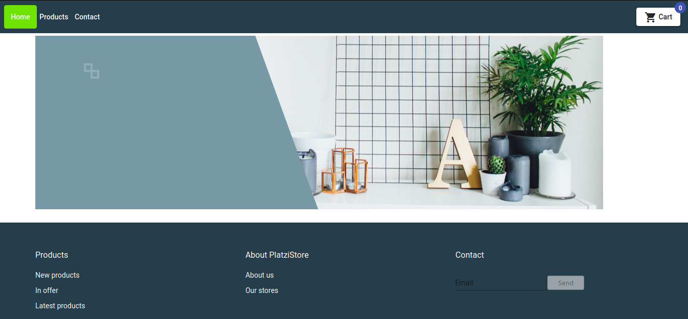

# Platzi store

This is a project created following the Angular de Platzi course, which is an article shop.

The topics worked on were:

- Using and creating the main Angular **directives**.
- Using and creating the main Angular **pipes**.
- Component **life cycle**.
- Component and module **routing** features.
- Application styles using **Angular Material**.
- Orient the project to **modules** in order to use **Lazy Loading**.
- HTTP requests to API Rest with **services**.
- Make the different pages of the application safe with **guardians**.
- Characteristics and foundations of **reactive programming**.
- Use **Firebase** as backend and use it for project deployment.

---

This is a preview of the home page:

---

You can visit [Platzi Store](https://platzi-store-e4e19.firebaseapp.com) and take a look :wink:.
